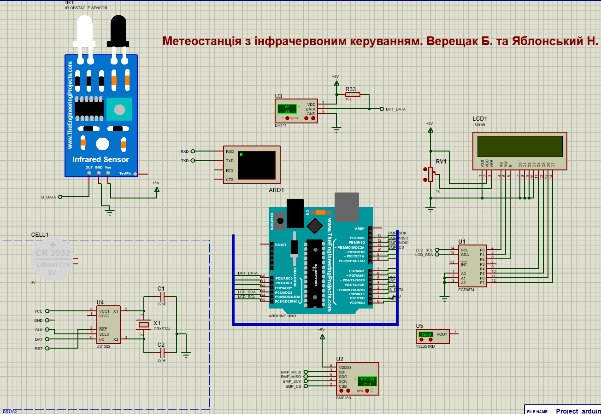

# Main System Functions
- Measuring temperature, humidity, pressure, and altitude above sea level, and displaying the data on the screen in real time.
- Displaying the current time and date obtained from the built-in real-time clock.
- Displaying measurement results on an LCD screen.
- Controlling switching using infrared signals.
- Switching between different display modes ({Celsius, Fahrenheit}, {Date and Time, Date Only, Time Only}).
- Pausing variable updates to capture data at a specific moment.
- Implementing a calculator mode that allows basic arithmetic operations.
- Storing the operating mode and the last calculated result in EEPROM memory.

# System Response to Environmental Changes
- Sensor values are updated every second.
- Operating mode changes are triggered by signals from the IR remote control.
- EEPROM memory is used to read and write data depending on the system state.

  

